# ASSY Ver3.0 - design review: BM-001

Branch CND-0001 | evidence rebuilt deterministically from recorded runs | zero provider calls

> **Evidence rule.** Every figure states its SOURCE. A model response that the
> write boundary refused is never shown as the accepted design; it is labelled
> `REJECTED - NOT DESIGNSTATE` and its refusal reasons are printed beside it.
> No number in this report was invented for it.

## Dashboard

| Stage | Source | Status | What exists | Main blocker |
|---|---|---|---|---|
| S04 | deterministic replay of accepted canonical DesignState | **ACCEPTED** | AssemblyStep 3, Body 3, Configuration 2, ConstraintRelation 6, EliminationRecord 1, Envelope 3, FunctionalRegion 4, Interface 4, Joint 3, LoadPath 5, MobilityExpectation 1, PhysicalInteraction 5, ReachResult 4, ReferenceScale 1, RigidGroup 4, State 2, SweptVolume 4, Transition 2, TransitionRequirement 2 | - |
| S05 | DeepSeek + canonical write boundary | **REJECTED - NOT DESIGNSTATE** | standing: NOTHING \| proposed: constraints 5, features 12, kinematic_realizations 6, parameters 6 | IR: feature FEA-0008 has 2 unconsumed steps (B2, B4); exactly one result IS the feature |
| S06 | deterministic settlement (no model) | **NOT ENTERED** | no system formulated; no value produced | settlement_readiness == False: no current embodiment (no standing feature) stands for CND-0001; there is nothing to settle for |
| S07 | deterministic CAD compilation | **NOT ENTERED** | no CAD artifact | S06 has not settled a system |

## Progression

```
S04  spatial / motion intent
       |
S05  physical symbolic embodiment
       |
S06  settled dimensions
       |
S07  actual CAD
```

## S04 - spatial / motion intent

The arrangement, the joint frames and the sampled motion evidence the downstream consumes.

`state_hash` = `26966a68bdf35f8f24bec19e704972ffaadd9a0962f493d74db19dfa01266486` | provider calls during rebuild: **0**

Rebuilt by:

- `ver3.tools.bm001_replay.build`
- `ver3.tools.bm001_replay.with_preserved_mating`
- `ver3.tools.reconcile_preselection.derive_arrival (deterministic s04a)`
- `owner-stage completions replayed by prompt hash from scratchpad/evidence/BM-001_parameter_authority`
- `ver3.tools.reconcile_preselection.qualify (feasibility)`

#### Joints

| Joint | Type | Bodies | Origin | Axis | STA-CFG-0001 | STA-CFG-0002 |
|---|---|---|---|---|---|---|
| JNT-0001 | FIXED | BOD-0003 -> BOD-0001 | `[-48, 0, 20]` | NONE | - | - |
| JNT-0002 | REVOLUTE | BOD-0002 -> BOD-0003 | `[-48, 0, 20]` | +Y | 0 | -90 |
| JNT-0003 | COMPLIANT | BOD-0002 -> BOD-0002 | `[40, 0, 30]` | +Y | 5 | 0 |

#### Transitions

| Transition | Moving group | Start | End | Sweep evidence |
|---|---|---|---|---|
| TRN-0001 | RGP-0002,RGP-0003,RGP-0004 | STA-CFG-0001 | STA-CFG-0002 | SWV-TRN-0001-RGP-0002 (SAMPLED, 9 samples), SWV-TRN-0001-RGP-0004 (SAMPLED, 9 samples) |
| TRN-0002 | RGP-0002,RGP-0003,RGP-0004 | STA-CFG-0002 | STA-CFG-0001 | SWV-TRN-0002-RGP-0002 (SAMPLED, 9 samples), SWV-TRN-0002-RGP-0004 (SAMPLED, 9 samples) |

### spatial layout

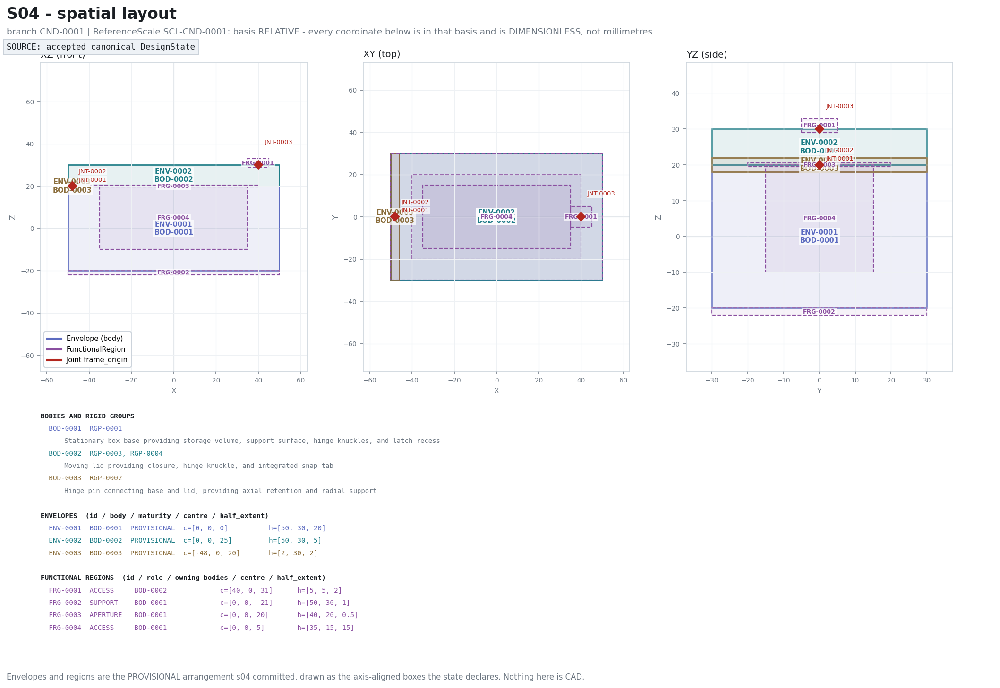

Bodies, rigid groups, envelopes, functional regions and joint origins in the arrangement frame.

### joint frames

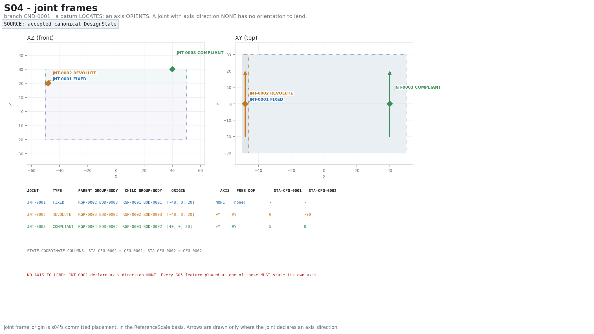

Every joint: type, the bodies it relates, its located origin, its axis, and its coordinate in each state.

### states and motion

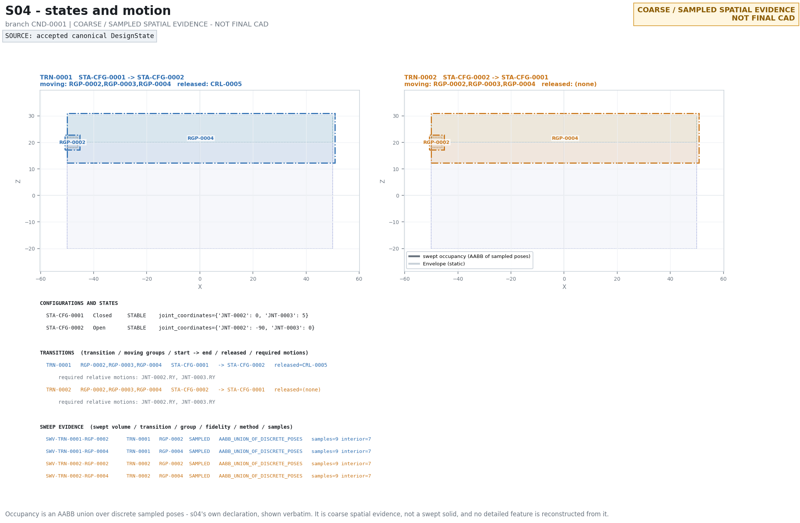

The configurations, the transitions between them, and the swept occupancy - one panel per transition.

**Evidence files:** `s04/state_summary.json`

## S05 - physical symbolic embodiment

The geometry that makes each declared relation real, symbolically. S05 declares parameters and never values.

### DeepSeek proposed -> write boundary -> canonical standing

**REJECTED - NOT DESIGNSTATE**

| Step | Result |
|---|---|
| 1. DeepSeek proposed | constraints 5, features 12, kinematic_realizations 6, parameters 6, realizations 0, unresolved 0 |
| 2. Write-boundary result | `execution_status = SCHEMA_FAILURE`, `patch_applied = False` |
| 3. Canonical standing S05 entities | **NONE** - no S05-owned entity stands for this branch |
| 4. Structural findings | 4 |
| 5. Settlement readiness | `False` |

**Exact rejection reasons (write boundary):**

- `IR: feature FEA-0008 has 2 unconsumed steps (B2, B4); exactly one result IS the feature`

**Deterministic structural findings (`downstream.embodiment.structural_problems`):**

- EMBODIMENT: constraint relation CRL-0001 blocks TX, TY, TZ, RX, RY, RZ and no KinematicRealization names it; the restraint is stated and nothing embodies it (its provider is the external reaction site RSR-0001, so only the retained side is owed material here)
- EMBODIMENT: constraint relation CRL-0004 blocks TX, TY, TZ, RX, RZ and no KinematicRealization names it; the restraint is stated and nothing embodies it
- EMBODIMENT: constraint relation CRL-0006 blocks TX, TY, TZ, RX, RY, RZ and no KinematicRealization names it; the restraint is stated and nothing embodies it (its provider is the external reaction site RSR-0002, so only the retained side is owed material here)
- EMBODIMENT: interface IFC-0001 declares INTERFERENCE_FIT and no Constraint governs it

_Standing on this branch but authored by other stages (not S05 output): UnresolvedDecision 12._

### write boundary

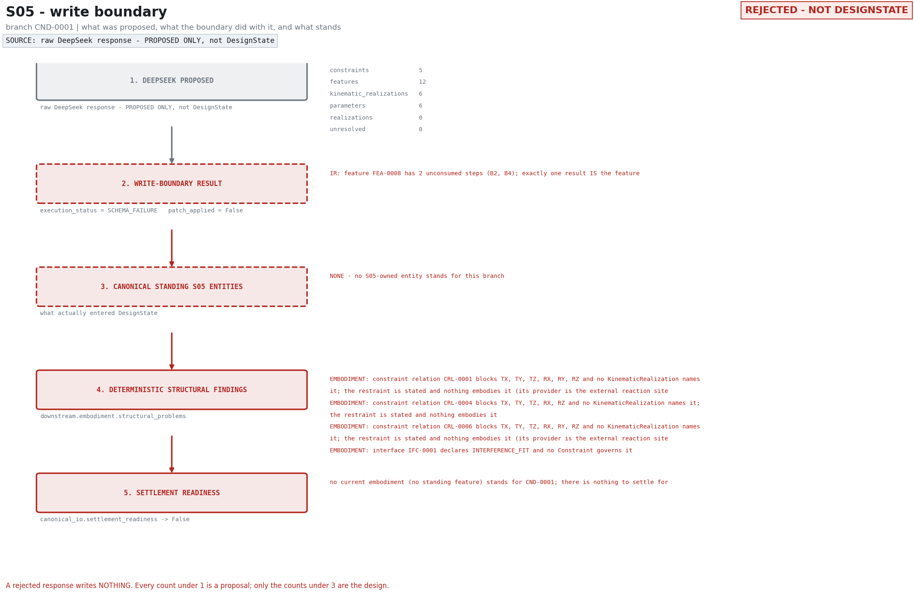

MANDATORY DISTINCTION: what was proposed, what the boundary did with it, what stands, what the checks found, and whether S06 may be entered.

### embodiment overview

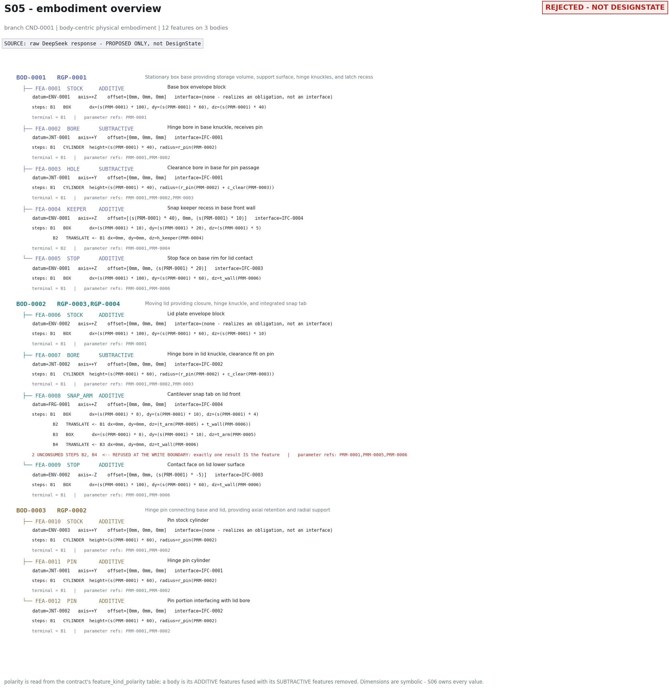

Body-centric: every feature, its kind, polarity, placement datum, axis, interface, construction steps and terminal.

### feature map

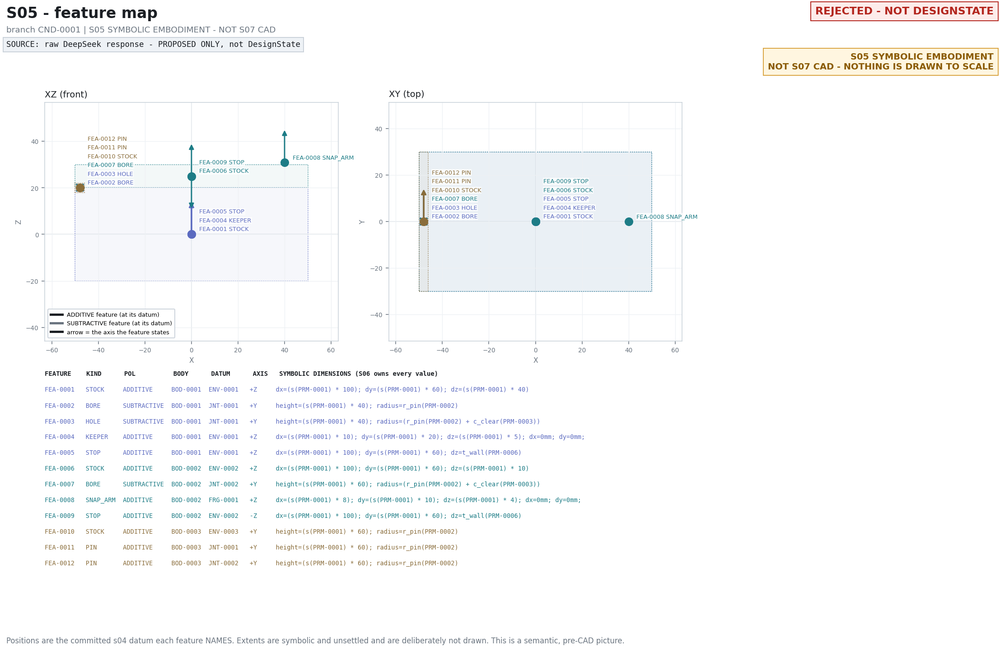

Each feature at the committed datum it names, with the axis it states. Symbolic - nothing is drawn to scale.

### kinematic realizations

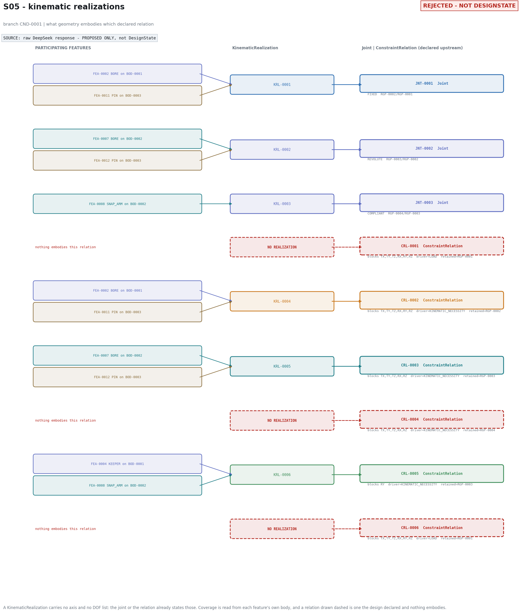

Feature(s) -> KinematicRealization -> Joint | ConstraintRelation, for every declared relation.

### interfaces

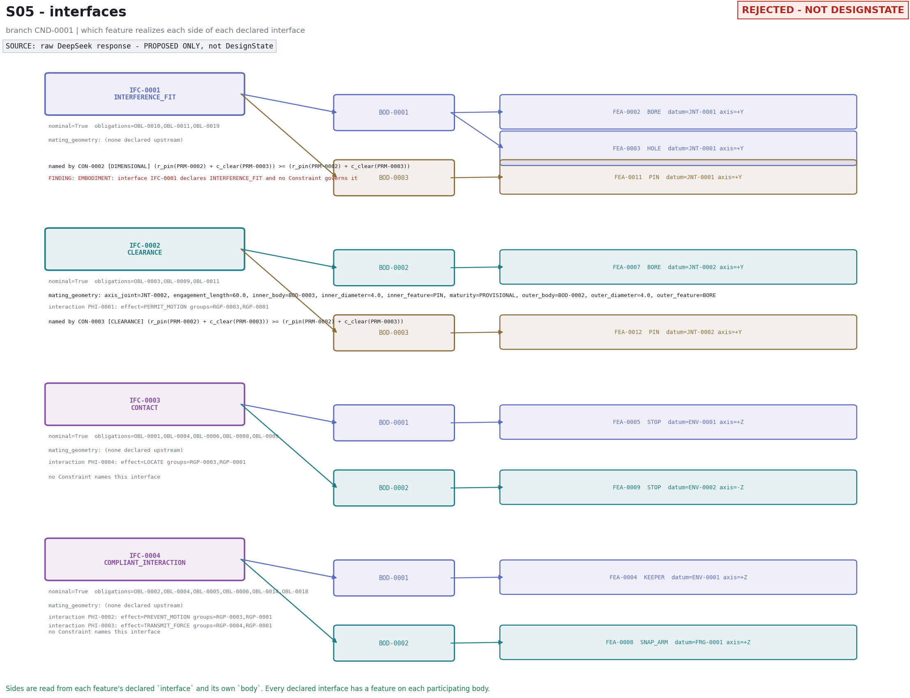

Interface -> the two bodies -> the feature realizing each side, with the deterministic finding printed against it.

### parameter constraint graph

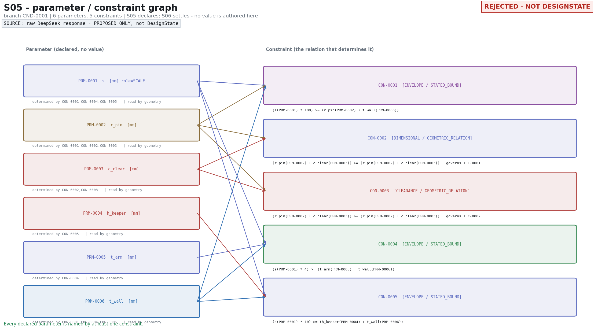

Parameter -> Constraint <- Parameter, with units, roles and what no constraint determines.

**Evidence files:** `s05/accepted_state_summary.json`, `s05/boundary_verdict.json`, `s05/provider_run_record.json`, `s05/raw_model_response.json`

## S06 - settled dimensions

Deterministic settlement of the declared system. Not a model result.

**S06 NOT ENTERED**

reason: `settlement_readiness == False`

- no current embodiment (no standing feature) stands for CND-0001; there is nothing to settle for

_No solver value exists and none is shown. This is not a failed solve: the solver was never run._

### constraint graph

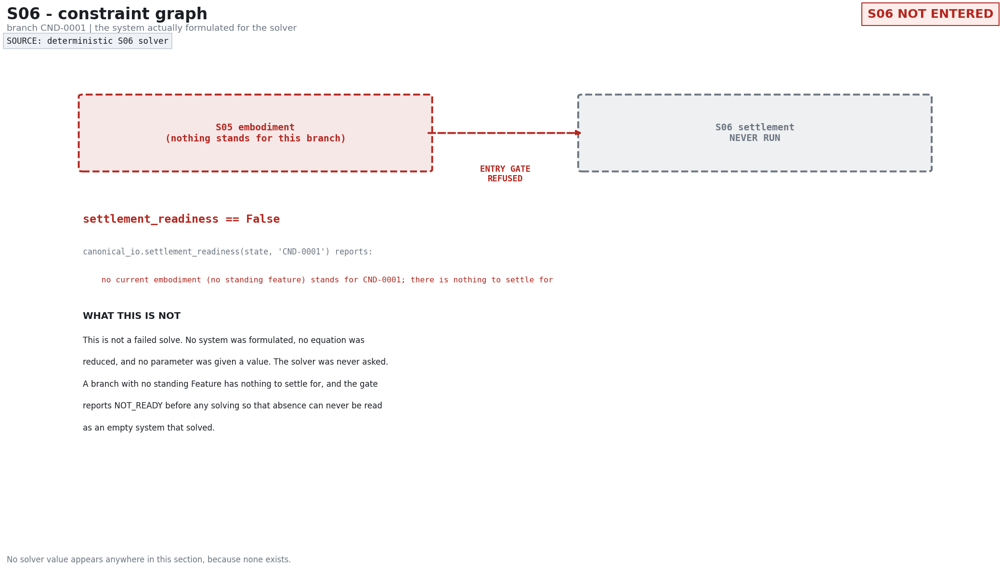

The system actually formulated for the solver, or the entry gate that stopped it.

### parameter values

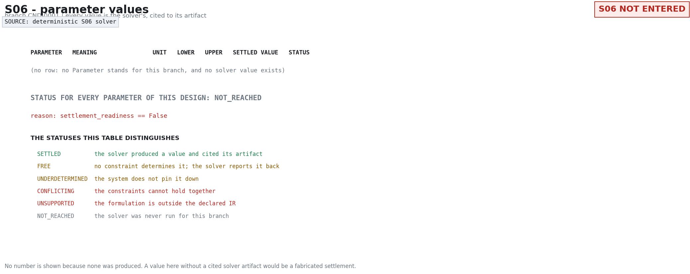

Parameter | meaning | unit | bounds | settled value | status.

**Evidence files:** `s06/solver_input.json`, `s06/solver_result.json`
