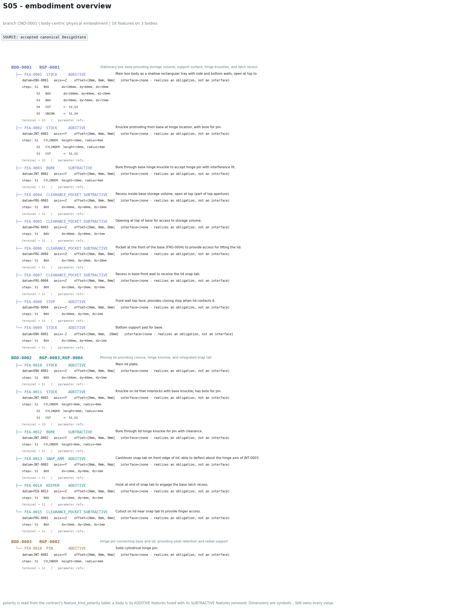
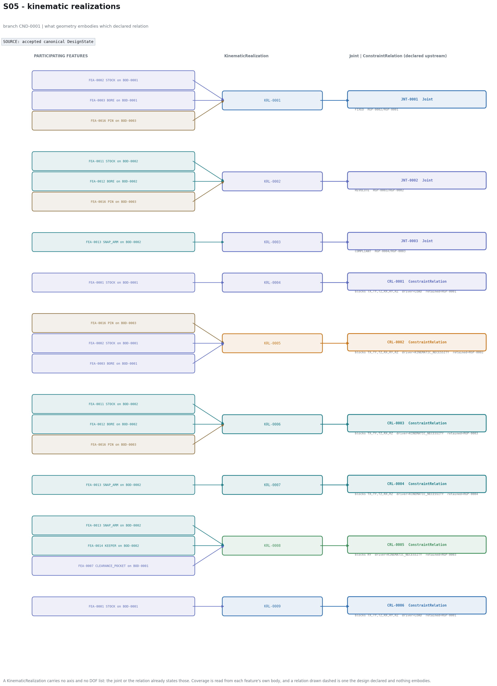
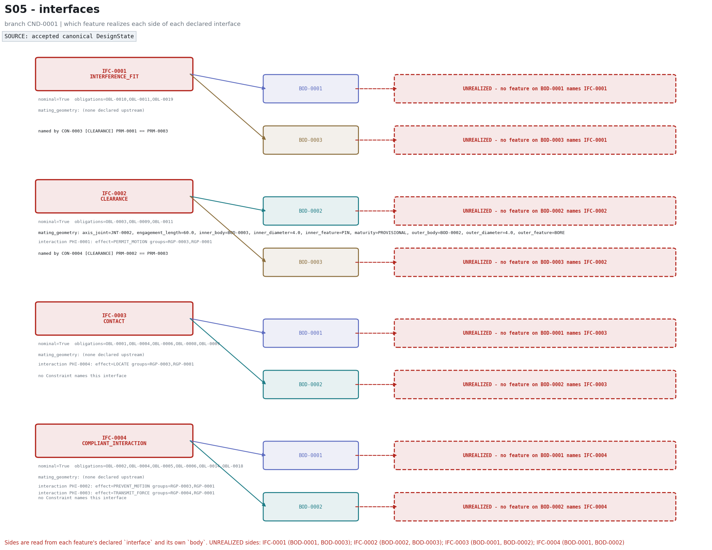
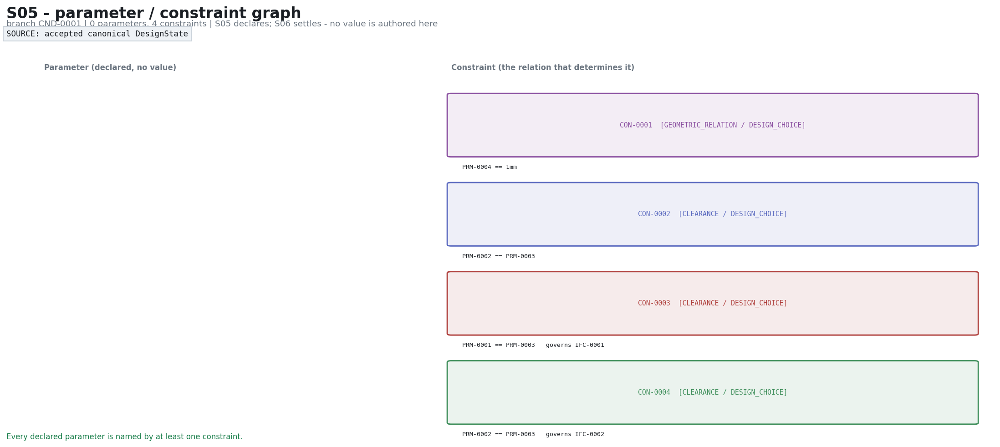
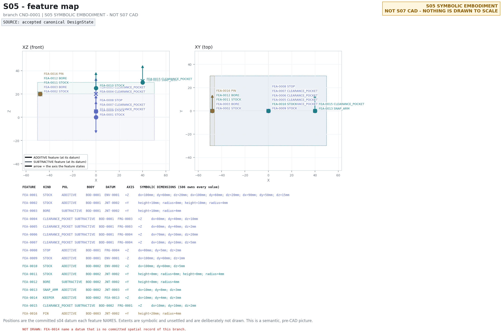

# ASSY Ver3.0 - S05 authoring boundary: every S04-valid candidate

BM-001 upstream rebuilt deterministically (zero provider calls) | one fresh DeepSeek S05 call per candidate through the new semantic boundary | S06 and S07 are deterministic and consume the accepted S05 result

> **Evidence rule.** Every figure states its SOURCE. A response the write
> boundary refused is stamped `REJECTED - NOT DESIGNSTATE` and is never drawn
> as the design. Only a branch whose S05 patch was APPLIED is visualized, and
> from its canonical standing rows.

## Verdict

**0 of 6 S04-valid candidates completed S05 -> S06 -> S07.**

S05 is **NOT CLOSED**.

## Matrix

| Candidate | S05 write ACCEPTED | structural_problems == [] | outstanding S05 duties == 0 | settlement_readiness == True | S06 settled | S07 built real B-reps | carried spatial/geometric evidence passes |
|---|---|---|---|---|---|---|---|
| CND-0001 | PASS | PASS | PASS | PASS | FAIL | FAIL | FAIL |
| CND-0002 | FAIL | FAIL | FAIL | FAIL | FAIL | FAIL | FAIL |
| CND-0003 | FAIL | FAIL | FAIL | FAIL | FAIL | FAIL | FAIL |
| CND-0004 | FAIL | FAIL | FAIL | FAIL | FAIL | FAIL | FAIL |
| CND-0005 | FAIL | FAIL | FAIL | FAIL | FAIL | FAIL | FAIL |
| CND-0006 | FAIL | FAIL | FAIL | FAIL | FAIL | FAIL | FAIL |

## Per candidate

### CND-0001

- **S04**: `Body 3, Configuration 2, ConstraintRelation 6, Envelope 3, FunctionalRegion 4, Interface 4, Joint 3, MobilityExpectation 1, PhysicalInteraction 5, ReferenceScale 1, RigidGroup 4, State 2, SweptVolume 4, Transition 2, TransitionRequirement 2` standing on branch; state hash `26966a68bdf35f8f24bec19e704972ffaadd9a0962f493d74db19dfa01266486`
- **Selection**: synthetic scratch commitment `SLD-C1AD91761F07` (NOT BM-001's decision)
- **DeepSeek S05**: `SUCCESS`, 11342 chars, 43.2s
- **Write boundary**: **ACCEPTED**

- **Canonical standing**: Constraint 4, Feature 16, KinematicRealization 9, Parameter 4
- **structural_problems**: []
- **outstanding duties**: []
- **settlement_readiness**: `True`











- **S06**: `underdetermined`

```
rank 3 over 4 unknown(s); 3 direction(s) remain free: PRM-0001, PRM-0002, PRM-0003
```

- **S07**: NOT ENTERED - None
- **Geometric evidence**: FAIL - 0 blocking finding(s) 

```
constraint CON-0001 carries no feasible settlement (none); the system was not settled feasible
constraint CON-0002 carries no feasible settlement (none); the system was not settled feasible
constraint CON-0003 carries no feasible settlement (none); the system was not settled feasible
constraint CON-0004 carries no feasible settlement (none); the system was not settled feasible
no scale authority: the basis is RELATIVE and its scale parameter PRM-0004 has no settled value
POSE_NOT_DERIVABLE (s05): feature FEA-0014 is placed against feature FEA-0013, whose frame is not derivable
```

### CND-0002

- **S04**: `Body 4, Configuration 2, ConstraintRelation 9, Envelope 4, FunctionalRegion 5, Interface 5, Joint 5, MobilityExpectation 2, PhysicalInteraction 5, ReferenceScale 1, RigidGroup 6, State 2, SweptVolume 8, Transition 2, TransitionRequirement 2` standing on branch; state hash `26966a68bdf35f8f24bec19e704972ffaadd9a0962f493d74db19dfa01266486`
- **Selection**: synthetic scratch commitment `SLD-08658A27B2A0` (NOT BM-001's decision)
- **DeepSeek S05**: `SCHEMA_FAILURE`, 28000 chars, 45.8s
- **Write boundary**: **REJECTED - NOT DESIGNSTATE**

  Refusal:

```
s05 response does not discharge this branch's embodiment duties (3):
  - parameter recess_depth (recess_depth) is named by no constraint; a parameter no constraint determines is a free direction the solver reports back and nothing can be built from it
  - parameter recess_height (recess_height) is named by no constraint; a parameter no constraint determines is a free direction the solver reports back and nothing can be built from it
  - parameter recess_width (recess_width) is named by no constraint; a parameter no constraint determines is a free direction the solver reports back and nothing can be built from it
```

- **S06**: NOT ENTERED - S05 was refused; nothing stands to settle

- **S07**: NOT ENTERED - S06 not entered
- **Geometric evidence**: FAIL - 0 blocking finding(s) 

### CND-0003

- **S04**: `Body 4, Configuration 3, ConstraintRelation 7, Envelope 4, FunctionalRegion 3, Interface 6, Joint 4, MobilityExpectation 2, PhysicalInteraction 5, ReferenceScale 1, RigidGroup 4, State 3, SweptVolume 4, Transition 4, TransitionRequirement 4` standing on branch; state hash `26966a68bdf35f8f24bec19e704972ffaadd9a0962f493d74db19dfa01266486`
- **Selection**: synthetic scratch commitment `SLD-DCCF0F3392A3` (NOT BM-001's decision)
- **DeepSeek S05**: `SCHEMA_FAILURE`, 22391 chars, 42.0s
- **Write boundary**: **REJECTED - NOT DESIGNSTATE**

  Refusal:

```
s05 response is not a semantic embodiment: feature base_plate solid parts[3] offset[1] declares kind {'kind': 'param', 'param': 'scl', 'unit': 'mm', 'role': 'SCALE'}; an expression is one of ['param', 'number', 'sum', 'difference', 'negate', 'scale_by', 'divide_by']
```

- **S06**: NOT ENTERED - S05 was refused; nothing stands to settle

- **S07**: NOT ENTERED - S06 not entered
- **Geometric evidence**: FAIL - 0 blocking finding(s) 

### CND-0004

- **S04**: `Body 2, Configuration 2, ConstraintRelation 4, Envelope 2, FunctionalRegion 6, Interface 4, Joint 1, MobilityExpectation 1, PhysicalInteraction 5, ReferenceScale 1, RigidGroup 2, State 2, SweptVolume 4, Transition 2, TransitionRequirement 2` standing on branch; state hash `26966a68bdf35f8f24bec19e704972ffaadd9a0962f493d74db19dfa01266486`
- **Selection**: synthetic scratch commitment `SLD-9ABA0CB6173C` (NOT BM-001's decision)
- **DeepSeek S05**: `SCHEMA_FAILURE`, 15939 chars, 37.5s
- **Write boundary**: **REJECTED - NOT DESIGNSTATE**

  Refusal:

```
s05 response does not discharge this branch's embodiment duties (2):
  - realization_assignments[CRL-0108] states a side for BOD-0013, which the relation does not relate
  - the relations that restrain JNT-0013 at coordinate 0.0 and at coordinate 2.0 are embodied by material in exactly the same place; one piece of geometry cannot produce a limit at two different positions of the same joint - the two limits sit at different coordinates and their geometry has to sit at different places too
```

- **S06**: NOT ENTERED - S05 was refused; nothing stands to settle

- **S07**: NOT ENTERED - S06 not entered
- **Geometric evidence**: FAIL - 0 blocking finding(s) 

### CND-0005

- **S04**: `Body 3, Configuration 3, ConstraintRelation 4, Envelope 3, FunctionalRegion 4, Interface 5, Joint 2, MobilityExpectation 2, PhysicalInteraction 5, ReferenceScale 1, RigidGroup 3, State 3, SweptVolume 8, Transition 4, TransitionRequirement 4` standing on branch; state hash `26966a68bdf35f8f24bec19e704972ffaadd9a0962f493d74db19dfa01266486`
- **Selection**: synthetic scratch commitment `SLD-59A744C18BF9` (NOT BM-001's decision)
- **DeepSeek S05**: `SCHEMA_FAILURE`, 15787 chars, 32.8s
- **Write boundary**: **REJECTED - NOT DESIGNSTATE**

  Refusal:

```
s05 response is not a semantic embodiment: feature key 'hasp_stop_ry' is used twice; a local key names one record
```

- **S06**: NOT ENTERED - S05 was refused; nothing stands to settle

- **S07**: NOT ENTERED - S06 not entered
- **Geometric evidence**: FAIL - 0 blocking finding(s) 

### CND-0006

- **S04**: `Body 3, Configuration 3, ConstraintRelation 5, Envelope 3, FunctionalRegion 4, Interface 6, Joint 4, MobilityExpectation 3, PhysicalInteraction 5, ReferenceScale 1, RigidGroup 4, State 3, Transition 4, TransitionRequirement 4` standing on branch; state hash `26966a68bdf35f8f24bec19e704972ffaadd9a0962f493d74db19dfa01266486`
- **Selection**: synthetic scratch commitment `SLD-C048DBFE20F8` (NOT BM-001's decision)
- **DeepSeek S05**: `SCHEMA_FAILURE`, 28798 chars, 51.7s
- **Write boundary**: **REJECTED - NOT DESIGNSTATE**

  Refusal:

```
s05 response is not a semantic embodiment: feature key 'handle_access_clear' is used twice; a local key names one record
```

- **S06**: NOT ENTERED - S05 was refused; nothing stands to settle

- **S07**: NOT ENTERED - S06 not entered
- **Geometric evidence**: FAIL - 0 blocking finding(s)
