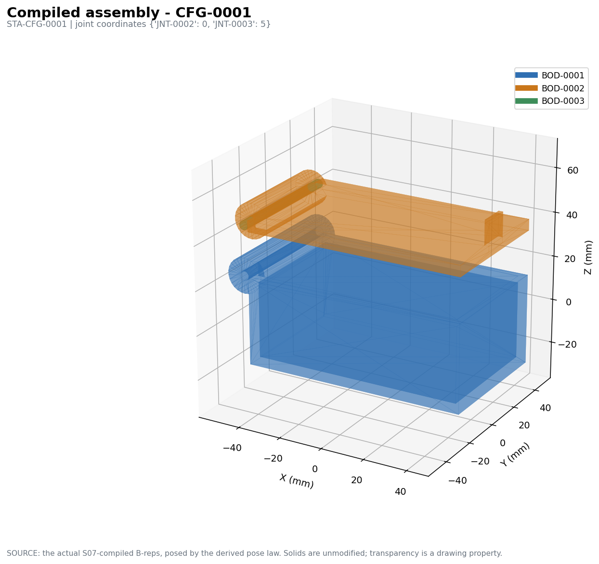
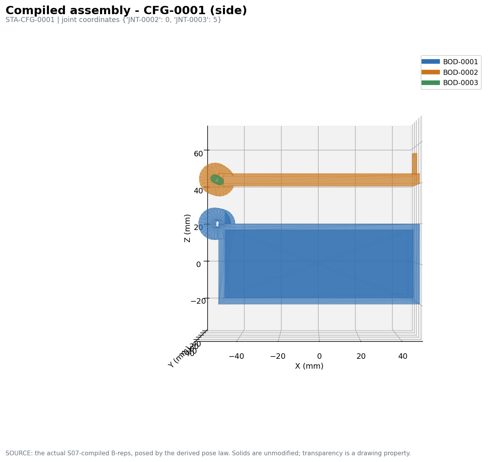
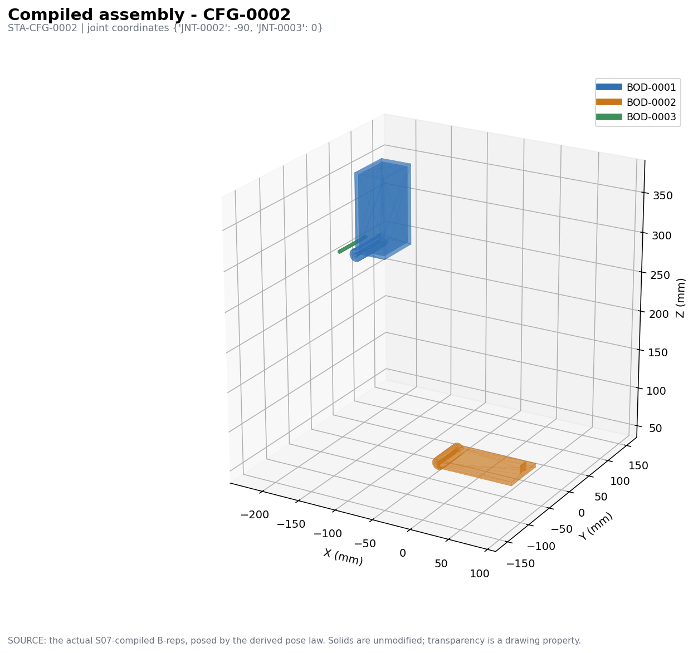
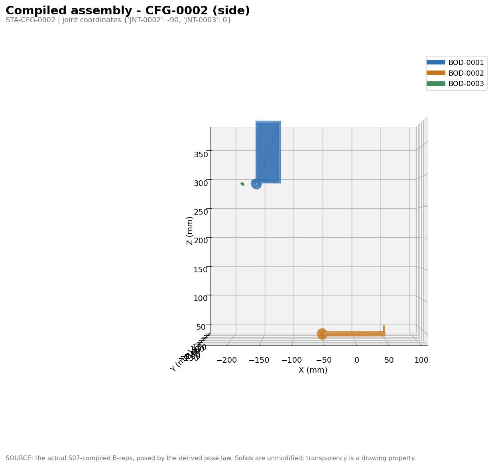
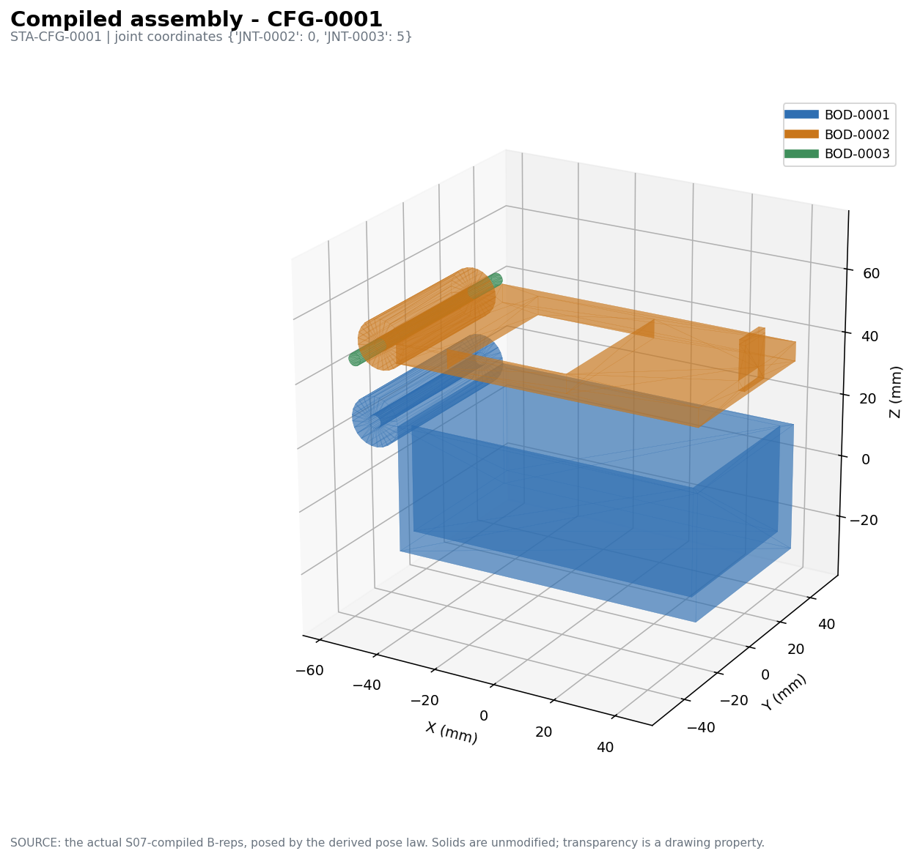
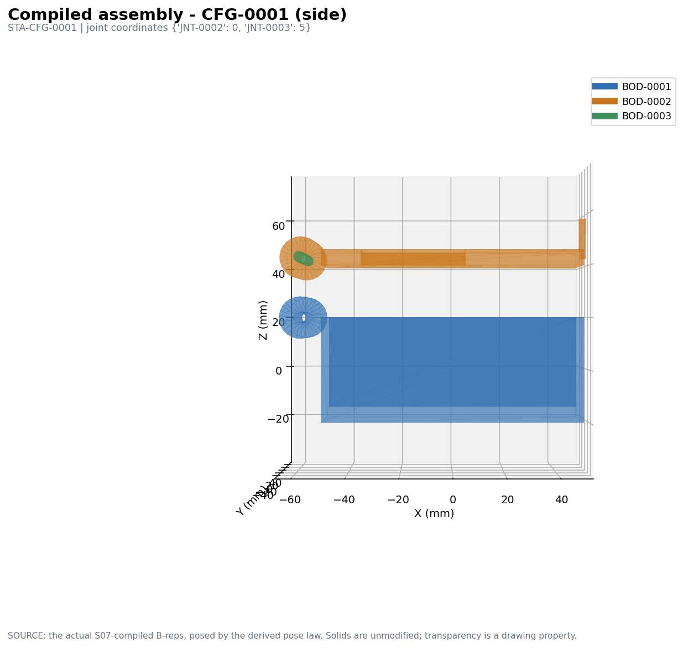
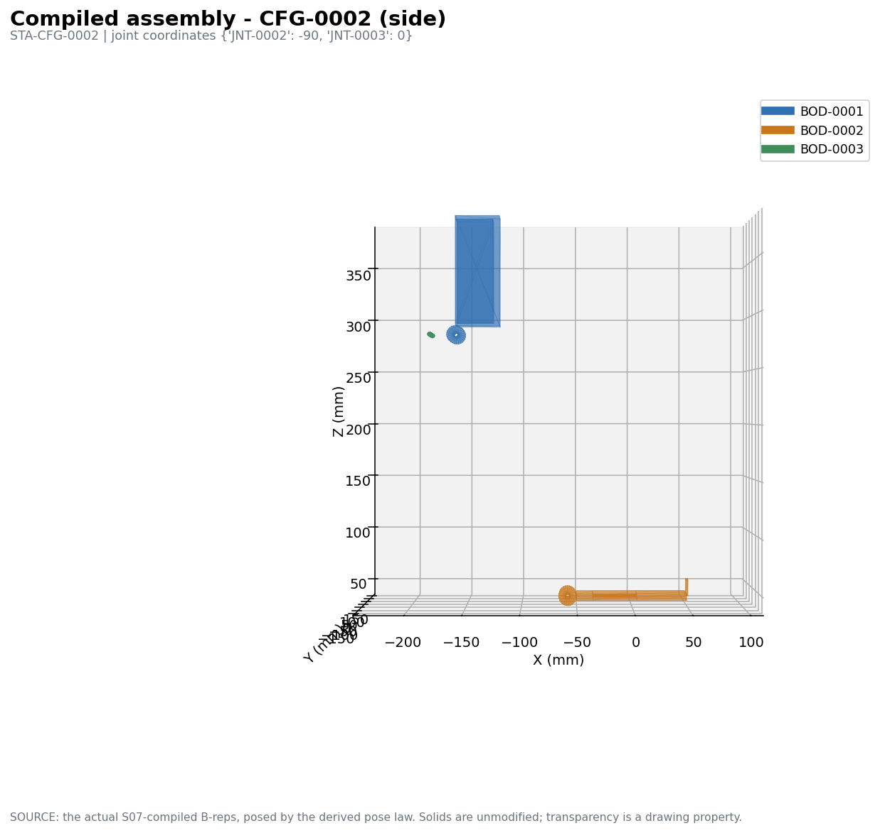

# S05 fresh-authoring + visual-revision pilot — CND-0001

An **independent** experiment, run with the same generic infrastructure as the
CND-0004 pilot and no knowledge of it. The round-1 authoring prompt, the simple
CAD language, the translator semantics and the visual-review procedure were
**not modified** for this candidate. The only candidate-specific input is the
real standing CND-0001 S04/S03 state. Nothing from CND-0004 — designs, renders,
failures, diagnoses or lessons — was fed in.

No production S05/S06/S07 semantics, validators, contracts or stage behaviour
were changed. Nothing committed.

**The question:** can the same DeepSeek fresh-CAD + DeepSeek-VL2 visual-feedback
loop produce a substantially more coherent physical embodiment for CND-0001 — a
hinged box/lid closure — without candidate-specific repair rules or human
geometric corrections?

**Answer: no. Round 1 was the best result this pilot has produced anywhere; the
visual-feedback round made it measurably worse.**

---

## A. The real CND-0001 design input

`s04_input.json`, rebuilt deterministically, zero provider calls.

| | |
|---|---|
| bodies / rigid groups | 3 / 4 — base `BOD-0001`, lid `BOD-0002`, pin `BOD-0003` |
| joints | 3 — incl. `JNT-0002` REVOLUTE |
| interfaces | 4 — `IFC-0001` INTERFERENCE_FIT, `IFC-0002` CLEARANCE, `IFC-0003` CONTACT, `IFC-0004` COMPLIANT_INTERACTION |
| constraint relations | 6 |
| configurations / states | 2 / 2 — `STA-CFG-0001` closed, `STA-CFG-0002` open |
| transitions / requirements | 2 / 2 |
| functional regions | 4 |
| assembly steps | 3 |
| reference scale | RELATIVE |

Envelopes were passed explicitly marked `BOUNDING EXTENT ONLY - this is not
material`.

## B. Round 1 — DeepSeek design quality

One call, 13.2 s, 6,366 chars. **`round1_parse_repair.json` records zero edits —
the response was valid JSON as emitted.**

The design is genuinely coherent as a mechanism, and it inferred the hinged-box
scheme from the upstream state alone:

- **base** — shell, cavity, top opening, hinge barrel, hinge bore, latch recess
- **lid** — plate, hinge knuckle, knuckle bore, snap tab, tab hook
- **pin** — a cylinder

It chose 11 nominal dimensions (`pin_diameter 4`, `bore_diameter = pin_diameter
+ 0.2`, `wall_thickness 3`, `snap_engagement 1.5`, …), used a symbolic relation
where a fit genuinely had to stay coupled, and tagged **two** real regions
(`FRG-0003`, `FRG-0004`) as cleared. All four interfaces were paired:

| interface | a | b | intent |
|---|---|---|---|
| IFC-0001 | base `hinge_bore` | pin | interference fit |
| IFC-0002 | lid `knuckle_bore` | pin | running clearance |
| IFC-0003 | base `base_shell` | lid `lid_plate` | seating contact |
| IFC-0004 | base `latch_recess` | lid `tab_hook` | snap engagement |

## C. Round 1 — S06 and S07

| | |
|---|---|
| S05 written | 12 features, 8 KRL, 12 constraints |
| entry gate | refused (6 duties, incl. 2 ungoverned fit/clearance interfaces and uncleared regions) |
| **S06** | **`feasible`, 12 unknowns, rank 12** |
| **S07 compile** | **`ok = True`** — BOD-0001 75,877.8 mm³, BOD-0002 37,841.5 mm³, BOD-0003 754.0 mm³, **each a single valid solid** |
| S07 evidence | ran; `workable = False`, **79 blocking findings** |

**This is the first S07 compile the pilot has ever accepted**, and the first time
the geometric-evidence pass ran at all. The findings are real mechanical
criticism of a buildable assembly: `MATING_NOT_REALIZED` (the lid sits 20 mm
above the base where `IFC-0003` expects contact; the latch pair is 34.5 mm
apart; the knuckle touches the pin where a clearance is declared) and
`FEATURE_OUTSIDE_REGION` (all three bodies occupy reserved region `FRG-0004`).

CAD in `cad_round1/`: per-body STEP/BREP/STL + assembly STEP per state.

## D. DeepSeek-VL2 visual critique

`deepseek-vl2-tiny`, the four actual round-1 PNGs, minimal intent only (colour →
body, hinged closure, lid turns about the hinge, which state is which). Saved
verbatim in `deepseek_vlm_round1_review.md`.

Its critique was **almost entirely non-specific**. It restated the prompt's own
checklist as findings — "the lid does not appear to turn about a coherent
hinge", "the pin, knuckle, lid, and base geometry do not look physical", "the
latch geometry looks unrelated", and literally "Anything obviously blocking or
nonsensical" — and its corrective section is the same list negated ("should
rotate smoothly", "should align properly", "should engage correctly"). It named
no part, no relationship and no observable feature of the images.

## E. Round 2 — the redesign

One call, 12.2 s, 6,681 chars, zero syntax edits.

**DeepSeek returned essentially its round-1 design.** Identical
`design_summary`, identical element names, identical relationships, identical
dimensions — plus **one** new element (`knuckle_relief`, a subtraction on the
lid) and one extra dimension. Given a critique with nothing actionable in it,
the model had nothing to act on.

## F. Round 2 — S06 and S07

| | round 1 | round 2 |
|---|---|---|
| features / KRL / constraints | 12 / 8 / 12 | 13 / 8 / 13 |
| S06 | `feasible`, rank 12/12 | `feasible`, rank 13/13 |
| BOD-0001 base | 75,877.8 mm³, **1 solid** | 78,648.5 mm³, **2 solids** |
| BOD-0002 lid | 37,841.5 mm³, **1 solid** | 33,626.8 mm³, **2 solids** |
| BOD-0003 pin | 754.0 mm³, 1 solid | 1,005.3 mm³, 1 solid |
| **S07 compile** | **`ok = True`** | **`ok = False`** — base and lid each disconnected |
| S07 evidence | ran, 79 findings | **never ran** (compile refused) |

**The one geometric change the loop produced was a regression.** The added
`knuckle_relief` cut the lid into two pieces, and the base likewise split.
Round 2 also lost ground structurally: the entry gate now additionally reports a
mis-attributed `JNT-0001` realization and a `PIN` mating side realized by the
wrong feature.

## G. Final visual comparison

All eight renders were given to `deepseek-vl2-tiny`. Its response, saved
verbatim in `deepseek_vlm_round2_comparison.md`, **is a restatement of the
prompt** — it repeated the colour key and which images were which version, and
made no comparison at all. The model did not perform the task.

## Remaining failure owner

| owner | verdict |
|---|---|
| **DeepSeek design** | Round 1 was strong — a coherent hinged box inferred from upstream alone, buildable, fully determined. Its real defects are metric: the lid floats above the base where contact is declared, the latch pair does not meet, and the bodies sit inside a reserved region. Round 2 added a relief that disconnected two bodies. |
| **VLM resolution** | **The primary failure of this iteration.** `deepseek-vl2-tiny` produced a critique with no observable content — it echoed the question list — and then failed the comparison task outright. A feedback loop cannot correct a design when the feedback carries no information about the design. |
| **translator** | No failure. No manual geometric repair; bookkeeping derived as before. |
| **S06** | No failure. Fully determined in both rounds. |
| **S07** | No failure. It accepted round 1, ran the evidence pass, and correctly refused round 2's disconnected bodies. One defect **in code I had added in an earlier migration** was found and fixed: `ASSEMBLY_BLOCKED` was used in `artifact.py` without being imported, raising `NameError` and preventing the evidence pass from ever completing. That is a one-line import fix to my own earlier change, not a semantic change, and it is what allowed S07 evidence to run for the first time. |

## Verdict

For CND-0001 the **fresh-CAD authoring mode succeeded further than anywhere
else**: valid JSON first time, a mechanically sensible hinged-box design
inferred from upstream state alone, a fully determined dimensional system, an
accepted S07 compile with three single valid solids, real CAD exports, and — for
the first time — actual geometric evidence against the compiled B-reps.

The **visual-feedback loop failed**. The reviewer produced no usable
observation, the redesign was consequently a near-copy, and the single change it
did make broke two bodies and lost the compile. Round 1 is strictly better than
round 2 by every machine-checked measure.

Compared with CND-0004, where the same loop did drive a real structural change
(rails/grooves inverted, housing 4 solids → 1), the difference here is not the
authoring mode but the **critique quality**. That points at the reviewer, not at
the loop's architecture.
