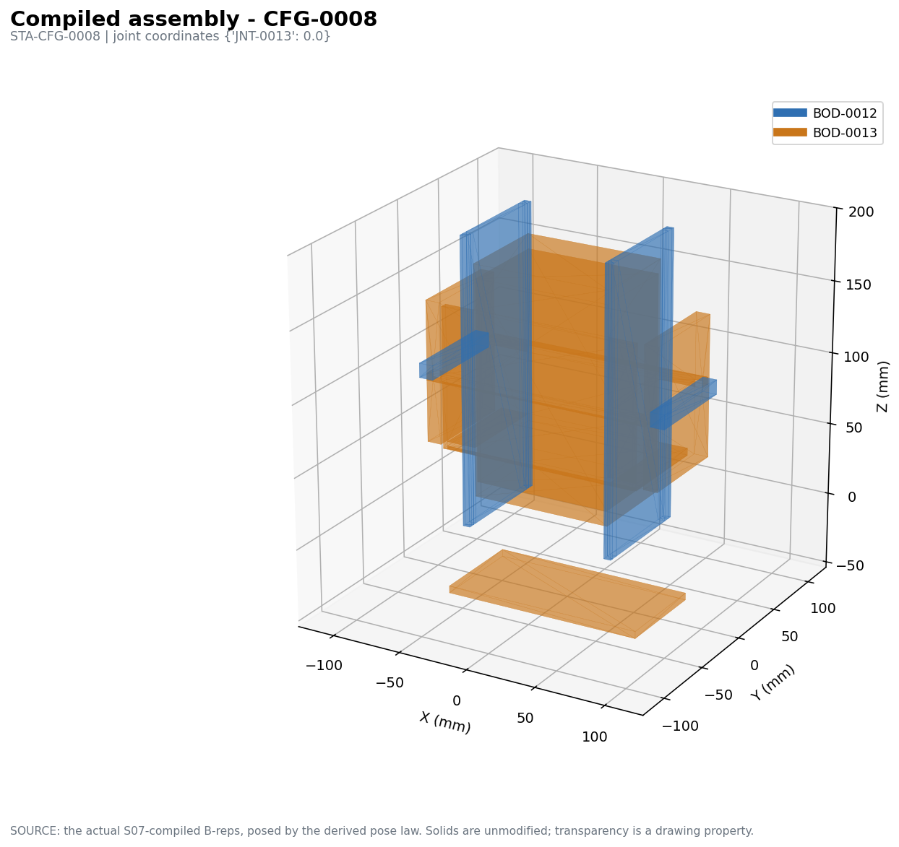
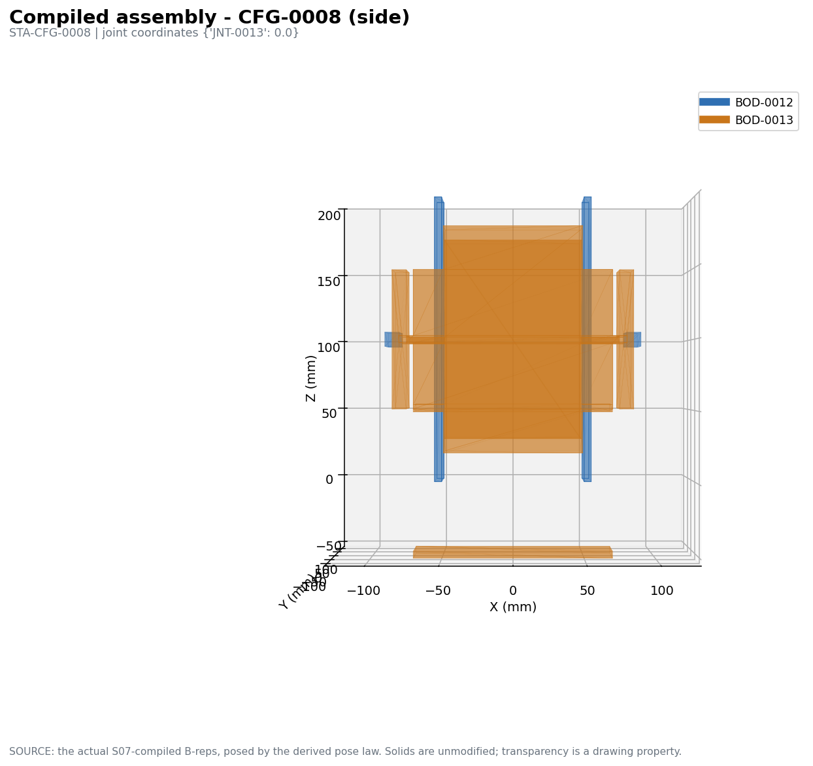
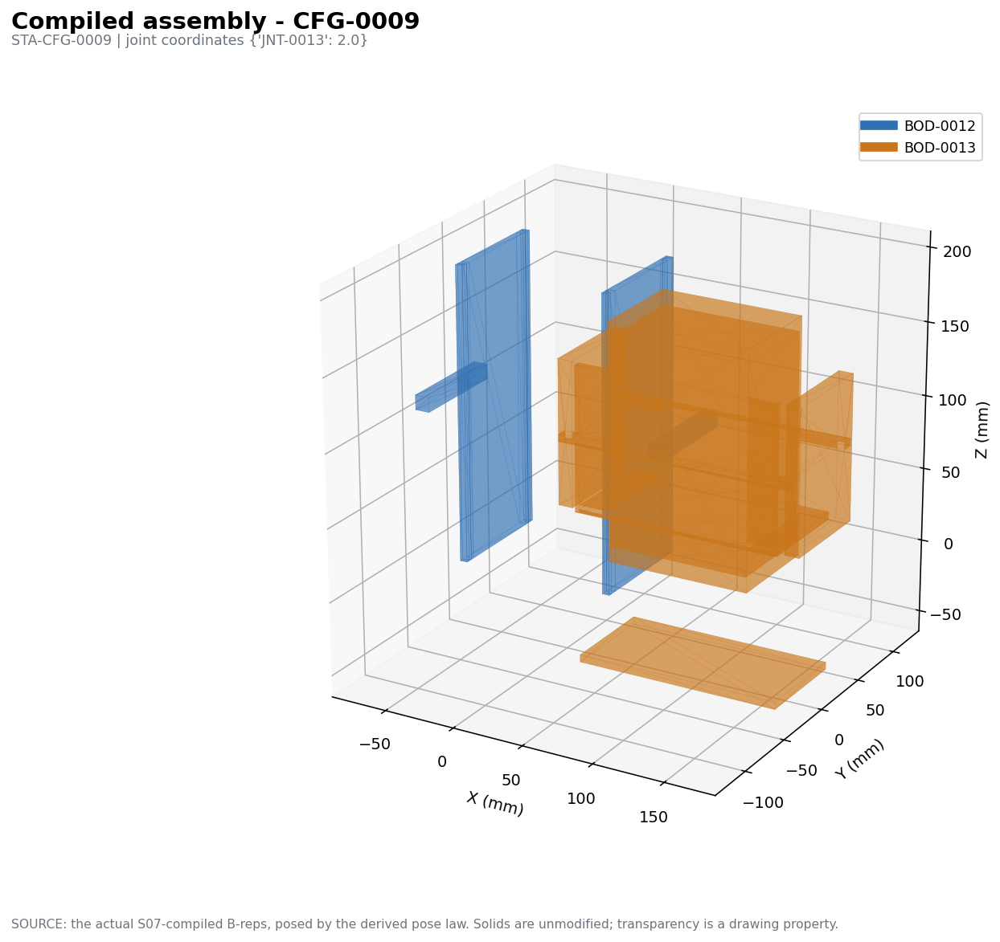
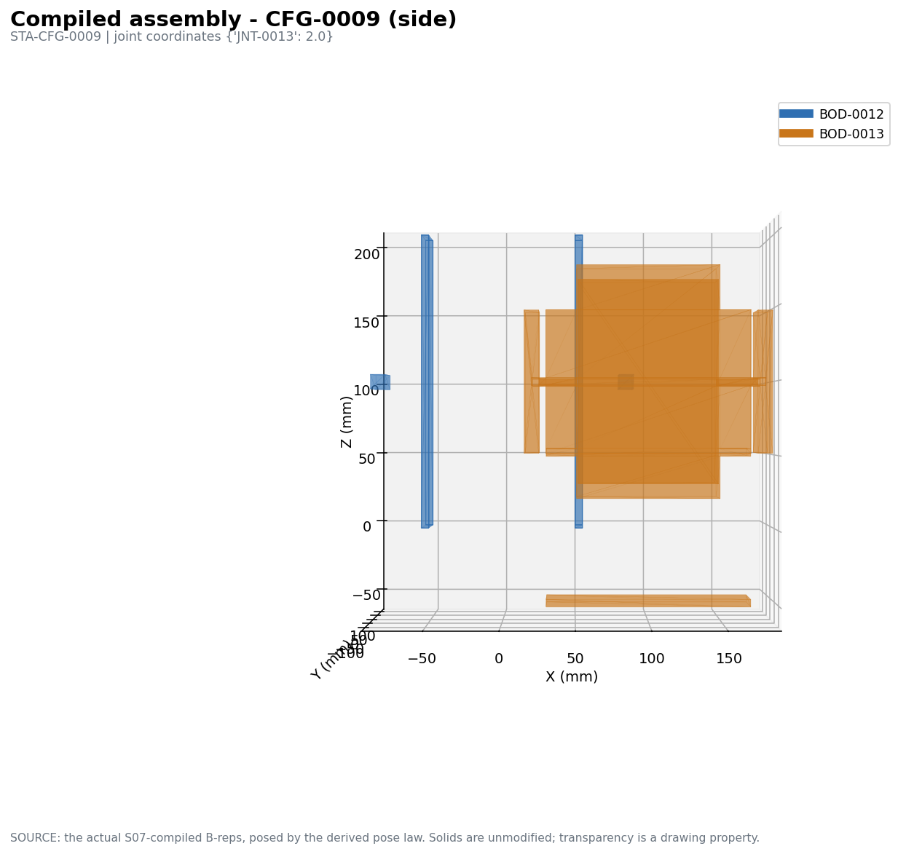
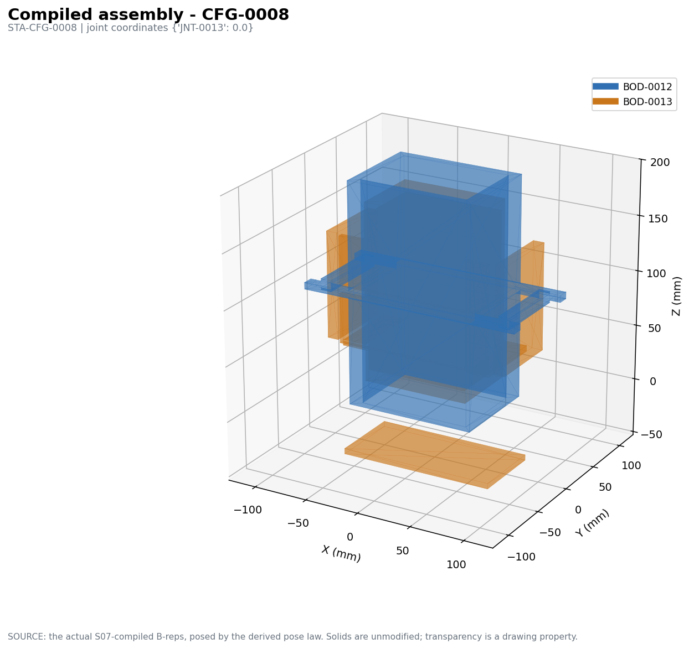
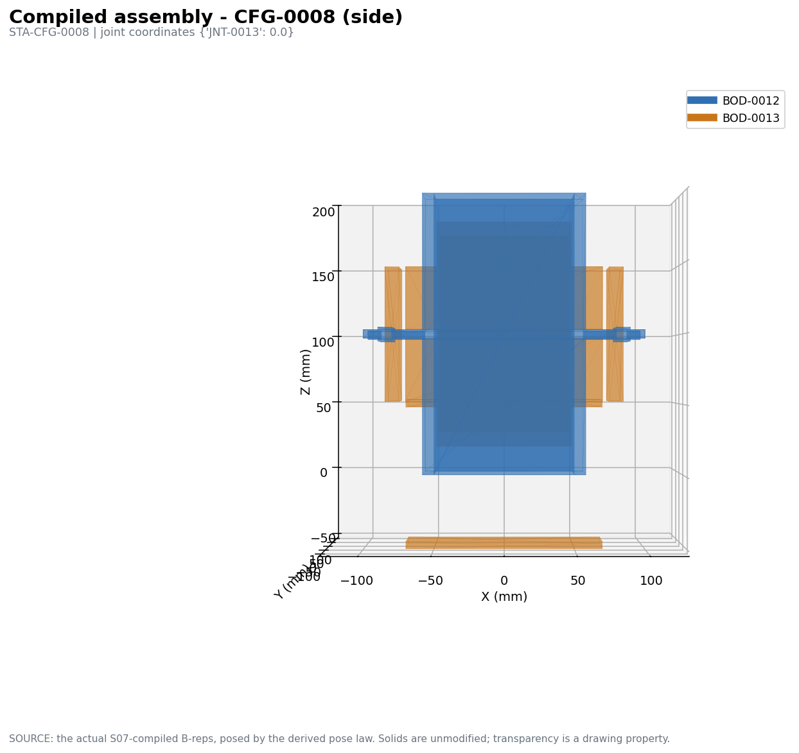
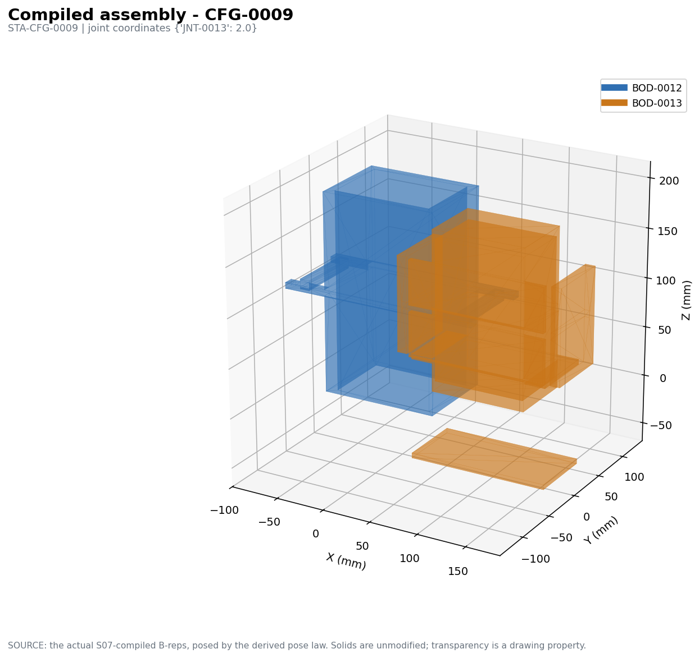
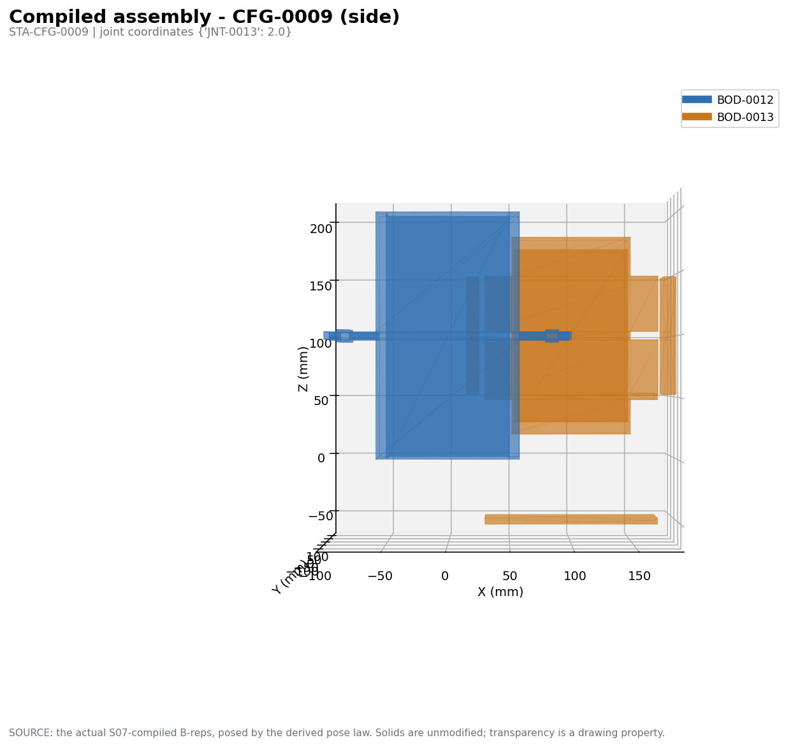

# S05 fresh-authoring pilot — CND-0004

One isolated experiment. **No production code was changed**, no production S05
prompt, validator or contract was touched, and nothing was committed. The
existing S06 solver and S07 compiler were reused unchanged.

**The question this answers:** does giving DeepSeek a *CAD design task* over the
real S04 state — instead of asking it to author the canonical S05 response —
produce a substantially more coherent physical embodiment and real CAD?

**Short answer: yes for the design, no for the geometry.** The authoring mode
produced a recognisably designed mechanism with real walls, real voids, paired
mating geometry and two limits at two different places, and it settled cleanly
into a fully determined dimensional system. The compiled solids were then
refused by the existing compiler because the design's *coordinates* do not put
its own pieces in contact: the housing came out as four disconnected plates and
the drawer as two.

---

## A. Actual S04 input used

`s04_input.json` — the standing branch for **CND-0004**, state hash
`26966a68bdf35f8f24bec19e704972ffaadd9a0962f493d74db19dfa01266486`, rebuilt
deterministically with zero provider calls.

| | |
|---|---|
| bodies / rigid groups | 2 / 2 |
| joints | 1 — `JNT-0013`, PRISMATIC, axis **+X**, frame origin `[0.5, 0, 0]` |
| interfaces | 4 — `IFC-0016/0017` CONTACT guides, `IFC-0018/0019` CONTACT stops |
| constraint relations | 4 — `CRL-0108` (external reaction site), `CRL-0109/0110/0111` |
| configurations / states | 2 / 2 — `JNT-0013` at **0.0** and **2.0** |
| transitions / requirements | 2 / 2 — required motion `JNT-0013.TX` |
| functional regions | 6 — 4 free-space (2 ACCESS, 2 APERTURE), 2 SUPPORT |
| assembly steps | 2 — housing first (`-Z`), drawer second (`+X`) |
| reference scale | RELATIVE, no absolute quantity |

Envelopes were supplied explicitly labelled `BOUNDING EXTENT ONLY - this is not
material`. No old S05 features, no previous S05 prompt text, no failed
responses, no previous CAD and no candidate-specific advice were included.

## B. The new S05 prompt

`fresh_prompt.txt` (18,812 chars). Written from zero as a CAD design brief. It
asks the model to picture the finished assembly and answer eight design
questions for itself before answering — what material each body contains, what
must stay empty, how the bodies mate, what permits the joint motion, what
provides each restraint, what changes between positions, whether the travel is
open, whether it can be assembled — and then to design parts so the answers are
yes. It states that an envelope is a bound and not a solid, and that the model
should choose real millimetre values rather than leave dimensions unknown.

It asks for **none** of: canonical ids, KinematicRealization rows,
`realization_assignments`, `interface_assignments`, `region_assignments`, step
ids, step DAGs, `Constraint.parameters`, raw expression AST, or lifecycle rows.

It contains no candidate id and no mechanism-family rule. The output language is
`design_summary`, `scale_mm_per_unit`, `dimensions`, `bodies[].elements[]`
(add/subtract box/cylinder), `intended_physical_relationships` and
`state_expectations`.

## C. Raw DeepSeek response

`raw_deepseek_response.txt` — one call, 16.3 s, 9,137 chars, not truncated. **No
retry and no second call.**

It did **not** parse: line 196 had an unterminated string
(`"channel_width - 2*drawer_clearance]`, missing the closing quote). The raw file
is kept byte-exact; `parse_repair.json` records the single syntax-only edit
(inserting that one quote) used to obtain `parsed_design_plan.json`. No value,
number, name or design content was changed. **This is a real authoring defect of
this mode and is counted as one below.**

## D. What DeepSeek actually designed

Full pre-translation reading in `design_assessment.md`. Written before any
translation and not revised afterwards.

- **Recognisable manufactured bodies — yes.** Housing: a 110×80×200 block with a
  100×70 channel cut through it, two side slots, an opening at each end and two
  stop lugs; 5 of its 10 elements are subtractions. Drawer: a 98×68×160 body with
  a 96×66×140 storage hollow, front pull face, rear panel, bottom panel, two side
  panels and two guide ribs. Neither body is its envelope filled in.
- **Real free volume — partly.** `front_aperture` is an explicit subtraction and
  the only element that says what it opens (`clears: FRG-0018`). Three of the
  branch's four free-space regions are never addressed.
- **Plausible path — stated, not built.** The travel magnitude is right (100 mm =
  2 units at the model's own 50 mm/unit). The direction is not: the joint is
  along **+X**, but `channel_cut` is long in **Z** while the guide ribs are long
  in **X**.
- **Mating/restraint geometry — present and paired.** All four interfaces get a
  geometry pair, and **the two travel limits are different geometry at different
  positions** (`front_stop_lug` at x∈[−90,−80], `rear_stop_lug` at x∈[80,90]).
- **One coherent assembly — as a scheme yes, in the numbers no.** Two real
  errors: `slot_width = 5.2 mm` but the rib's extent in the fit direction is
  `rib_height = 8 mm` (the dimension names were crossed), and both bodies exceed
  their S04 envelopes in Z.

## E. Experimental translation into canonical S05

`translation_log.json`. The scratch translator produced **44 operations, accepted
by the DesignState write boundary unchanged**:

| produced | count |
|---|---|
| Features (one per design element) | 19 |
| Parameters (one per named dimension + SCALE) | 10 |
| Constraints (8 fixed by choice, 1 by relation, 1 scale) | 10 |
| KinematicRealizations | 5 |

Everything the model was previously forced to author was derived:

- **KRL for `CRL-0109/0110/0111`** — from each relation's own `provider_site`
  interface.
- **KRL for `JNT-0013`** — from `PHI-0011`, a PhysicalInteraction with effect
  `PERMIT_MOTION` at `IFC-0016`.
- **KRL for `CRL-0108`** — external reaction site; upstream names no interface,
  so the retained body's own material was used. **This is the one place the
  translator chose rather than derived**, and it is recorded in the log.
- **`Feature.interfaces`** — from the relationships naming each element.
- **Dimensions** — a concrete value became `Parameter + (== value)` with basis
  `DESIGN_CHOICE`; the one stated relation (`slot_width = rib_width +
  guide_clearance`) became a `GEOMETRIC_RELATION` constraint. So S06 saw no free
  variable merely because a designer picked a size.

No geometry was hand-edited. Three translator defects were found and fixed, all
infrastructure: a missing unary-minus rule in the expression parser, missing
`carry_invocation_premises` (records were written but belonged to no branch),
and the renderer using the gated settlement path.

**Resulting S05 state:** structural problems fell from 19 to **3**. Every joint,
restraint, interface side and body-material duty is satisfied. The three
remaining are free-space regions `FRG-0013`, `FRG-0014`, `FRG-0015` — the ones
the design never mentioned.

## F. S06 result

`settlement_readiness` is **False** on those three region duties, so the entry
gate refuses. That is unrelated to whether the dimensions settle, so the **same
S06 solver was called directly**, with the bypass disclosed here and in
`pipeline2.py`.

| | |
|---|---|
| parameters | 10 |
| constraints | 10 |
| unknowns | 10 |
| **rank** | **10** |
| **status** | **`feasible`** |

Settled values: `scale_mm_per_unit 50`, `housing_wall 5`, `guide_clearance 0.2`,
`channel_width 100`, `channel_height 70`, `drawer_clearance 1`, `rib_height 8`,
`rib_width 5`, `slot_width 5.2`, `stop_overlap 3`.

**A fully determined system, first pass.** This is the direct contrast with
CND-0001 in the previous matrix, which passed S05 readiness and then returned
`underdetermined`: letting the designer choose nominal values, and turning each
choice into an equality, removes that failure entirely.

## G. S07 result and geometric findings

The existing compiler, unchanged. It **built both bodies and both are valid
solids**:

| body | volume | solids | valid |
|---|---|---|---|
| BOD-0012 | 174,000 mm³ | **4** | yes |
| BOD-0013 | 452,260 mm³ | **2** | yes |

**`result.ok = False`**, refused by the compiler's own rule:

```
S07-C2: body BOD-0012 compiled to 4 solids; a body must be a single connected solid
S07-C2: body BOD-0013 compiled to 2 solids; a body must be a single connected solid
```

Because compilation was refused, `artifact.validate` did not run, so there is
**no** interference / region / travel / assembly evidence for this design. That
evidence stage was never reached.

The refusal is correct and is the sharpest finding of the experiment: the design
placed its own pieces where they do not touch. The stop lugs sit at x∈[±80,±90]
while the housing block ends at x=±55, so they float free; the drawer's side
panels sit at z≈±51 while the drawer body spans z∈[20,180].

## H. Actual CAD renders

Renders of the **actual compiled B-reps**, posed by the real pose law. Solids are
unmodified; transparency is a drawing property only.






The pictures show what the compiler reported. The housing is two tall plates plus
two detached lugs; the drawer is a slab with a detached bottom panel. In
`cfg0009` the drawer has translated **+100 mm in X** — the travel is real and in
the right direction — but it slides straight out past the plates, because the
housing's channel runs in Z while the motion is in X.

Exported CAD in `cad/`: `BOD-0012.step/.brep/.stl`, `BOD-0013.step/.brep/.stl`,
`assembly_STA-CFG-0008.step`, `assembly_STA-CFG-0009.step`.

## I. Comparison with the previous CND-0004 failure

| | previous production S05 | this pilot |
|---|---|---|
| housing material | one STOCK solid filling the envelope | block with channel, slots, two end openings, two lugs — 5 subtractions |
| free volume | none modelled | one aperture explicitly cleared (1 of 4 regions) |
| travel limits | both at the same zero-offset datum | two distinct lugs, x = −85 and x = +85 |
| mating geometry | features per duty | rib↔slot and face↔lug pairs, with a stated clearance each |
| dimensions | all symbolic | 9 nominal values + 1 relation |
| S06 | `feasible` (trivially) / `underdetermined` elsewhere | `feasible`, rank 10 of 10 |
| S07 | compiled, exported STEP | built valid solids, **refused: disconnected** |
| mechanical sense | none — a solid block with coincident stops | a real scheme with wrong coordinates |

The previous mode produced CAD that passed and meant nothing. This mode produced
CAD that fails for a reason a designer would recognise and could fix.

## Failure attribution

- **Failure of the new DeepSeek design — yes, three, and they are the blocking
  ones.** (1) Malformed JSON (one unterminated string). (2) Axis inconsistency:
  channel long in Z, guides long in X, joint along X. (3) Elements placed where
  they do not touch, giving disconnected bodies; plus a rib larger than its slot,
  three unaddressed free-space regions, and envelope overruns in Z.
- **Failure of the scratch translator — three, all fixed, none blocking.** Unary
  minus, invocation premises, renderer settlement path. One translator *choice*
  remains and is disclosed: the KRL for the external-reaction-site relation.
- **Failure of S06 — none.** The solver settled a fully determined system on the
  first pass.
- **Failure of S07 / evidence — none.** The compiler behaved correctly; it built
  what it was given and refused it for a real defect. The geometric-evidence
  stage was never reached, so it is neither pass nor fail here.

## Verdict

Giving DeepSeek a CAD-design task over the real S04 state produced a
**substantially more coherent physical embodiment** — real part structure, paired
mating geometry, distinct limits at distinct positions, and a dimensional system
that settles first time — and **real CAD files**. It did **not** produce a
mechanically working assembly: the parts' coordinates are internally
inconsistent, so the compiler refused the bodies as disconnected and no
geometric evidence was computed.

The authoring mode is a clear improvement in *design content*. The remaining gap
is *spatial consistency between elements*, which nothing in this pilot asked the
model to check and nothing before compilation would catch.

---

# Round 2 — one visual revision iteration

Same experiment, one iteration. No production code changed, nothing committed.
The revision was driven **only** by a visual critique from an external VLM; the
orchestrator contributed no diagnosis and no repair advice.

## The VLM path (infrastructure)

The visual reviewer is **DeepSeek-VL2-tiny**, the official
`deepseek-ai/deepseek-vl2-tiny` weights run through the official
`deepseek-ai/DeepSeek-VL2` source. It runs on the existing **psed310**
interpreter — no second conda environment, and psed310's own
`transformers 4.57.6` / `torch 2.10.0+cu128` were left in place. The official
code needs `transformers 4.38.2`, so that version plus `tokenizers 0.15.2` was
installed into a scratch `--target` directory (98 MB) and prepended to
`PYTHONPATH` **for the inference process only**.

Additive packages installed into psed310: `attrdict3`, `timm`, `einops`,
`sentencepiece`, `xformers` (0.0.35, verified functional against torch 2.10).

One incompatibility could not be shimmed and is recorded for completeness:
`deepseek-vl2-tiny` sets `use_mla: false`, so its decoder instantiates
`transformers`' own `LlamaAttention`, whose `forward` signature gained a
required `position_embeddings` argument between 4.38 and 4.57. That is a changed
contract, not a rename. The scratch-local 4.38.2 path resolves it properly.

## A. VLM review of the round-1 CAD

The four round-1 PNGs — renders of the actual compiled B-reps — were fed
directly to DeepSeek-VL2-tiny with only the minimal design intent (which colour
is which body, housing-with-drawer, one prismatic translation, which state is
which end, moving body should stay guided). Its response is saved verbatim in
`deepseek_vlm_round1_review.md`. In summary it reported the moving body
misaligned with respect to the stationary body, a noticeable gap between them,
the open state not assemblable, and asked qualitatively for guide rails or pins
that capture the moving body and keep it aligned through its travel.

## B. One DeepSeek revision call

`round2_prompt.txt` (28,195 chars) carried exactly three things: the unchanged
`s04_input.json`, the complete round-1 design plan, and the VLM review verbatim.
One call, 13.6 s, 8,925 chars, not truncated. As in round 1 the response needed
one syntax-only edit (a missing closing quote, `round2_parse_repair.json`); the
raw file is byte-exact.

**The design changed structurally, not cosmetically.** The guide scheme was
inverted: round 1 put ribs on the drawer running in slots in the housing; round 2
puts **guide rails on the housing** running in **grooves in the drawer** — a
male-on-stationary / female-on-moving pair, which is what the review asked for
qualitatively. The housing went from 10 elements to 8, the drawer from 9 to 9 but
with 3 subtractions instead of 1.

| | round 1 | round 2 |
|---|---|---|
| IFC-0016 | drawer rib ↔ housing slot | **housing rail ↔ drawer groove** |
| IFC-0017 | drawer rib ↔ housing slot | **housing rail ↔ drawer groove** |
| IFC-0018 | rear panel ↔ rear stop lug | rear panel ↔ rear stop lug |
| IFC-0019 | front pull face ↔ front stop lug | front pull face ↔ front stop lug |

## C. Translation, S06, S07

Same scratch translator, no manual geometry edits, no translator fixes needed
this round. `round2_translation_log.json`.

| | round 1 | round 2 |
|---|---|---|
| features / parameters / constraints / KRL | 19 / 10 / 10 / 5 | 17 / 11 / 11 / 5 |
| S06 | `feasible`, rank 10 of 10 | **`feasible`, rank 11 of 11** |
| BOD-0012 (housing) | 174,000 mm³, **4 solids** | 622,064 mm³, **1 solid** |
| BOD-0013 (drawer) | 452,260 mm³, **2 solids** | 465,080 mm³, **4 solids** |
| S07 refusals | both bodies disconnected | **housing now connected**; drawer still 4 pieces |

The S06 entry gate refused both rounds identically, on the same three uncleared
free-space regions (`FRG-0013`, `FRG-0014`, `FRG-0015`); the design names only
`FRG-0018`. As in round 1 the gate — and only the gate — was bypassed so the
unchanged design could be compiled and seen. **That bypass is not S05 passing.**

CAD exports in `cad_round2/`: per-body STEP/BREP/STL and an assembly STEP per
state.

## D. Round-2 renders






Same camera conventions as round 1.

## E. Final VLM comparison

All eight renders (both rounds, both states) were given to DeepSeek-VL2-tiny.
Its response is saved verbatim in `vlm_round2_comparison.md`. It reported
version 2 as improved on every one of the seven axes it was asked about — body
coherence, connection of previously detached geometry, guide and mating
alignment, capture and support of the moving body, plausibility of both states,
and visual continuity across the motion — and did not name a remaining defect.

## F. The experiment's question

> Can a DeepSeek CAD author materially correct a mechanically nonsensical first
> embodiment when it is shown visual evidence of the actual CAD result, without
> candidate-specific rules or manually calculated geometric repair instructions?

**Partially, and measurably — but not to a working mechanism in one iteration.**

What is objectively true, independent of any reviewer's opinion:

- The redesign was **structural**, not a patch: the guide scheme was inverted
  from drawer-rib-in-housing-slot to housing-rail-in-drawer-groove.
- **The housing became a single connected solid** (4 pieces → 1). That is the
  one hard, machine-checked improvement, and it came from a purely visual
  critique with no coordinates, no measurements and no instructions from the
  orchestrator.
- The dimensional system stayed fully determined (`feasible`, rank 11 of 11).
- **The drawer got worse** by the same measure (2 pieces → 4), and S07 still
  refuses the assembly.
- The three uncleared free-space regions were **not** addressed — the review
  never mentioned them, so nothing prompted it.

Failure attribution for round 2:

- **DeepSeek design** — the remaining blocker. The drawer's elements still do
  not all touch.
- **Scratch translator** — no failure this round.
- **S06** — no failure.
- **S07 / evidence** — no failure; it built what it was given and refused it for
  a real defect. Geometric evidence was again never reached.
- **VLM** — the review was genuine and drove a real structural change, but
  `deepseek-vl2-tiny` is a small model and its critique was coarse: it described
  misalignment and gaps in general terms, never identified that a *specific*
  body was in disconnected pieces, and in the comparison reported improvement on
  every axis including ones where the geometry measurably regressed. The
  feedback loop works; the resolution of the feedback is the limiting factor.
